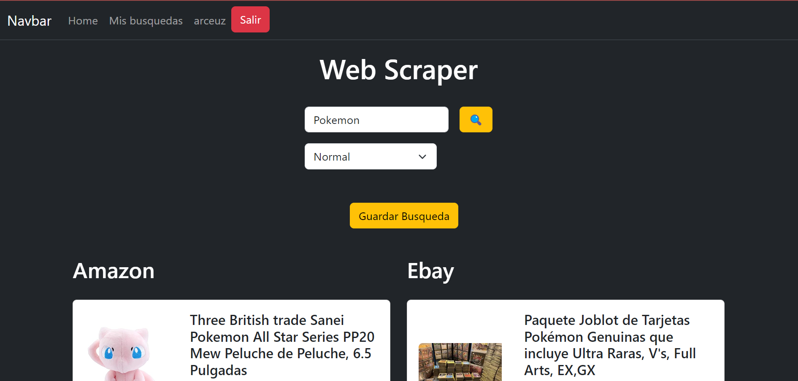

<div align="center" id="top">
     
</div>

# <h1 align="center">ATM Excercise</h1>

<p align="center">
  <a href="#dart-description">Description</a> &#xa0; | &#xa0; 
  <a href="#dart-demo">Demo</a> &#xa0; | &#xa0;
  <a href="#memo-improvements">Improvements</a> &#xa0; | &#xa0;
  <a href="#art-technologies">Technologies</a> &#xa0; | &#xa0;
  <a href="#white_check_mark-requirements">Requirements</a> &#xa0; | &#xa0;
  <a href="#toolbox-installation">Installation</a> &#xa0; | &#xa0;
  <a href="#joystickhow-to-play">How to Play</a> &#xa0; | &#xa0;
  <a href="#briefcase-license">License</a> &#xa0; | &#xa0;
  <a href="https://github.com/arturomsoberanes" target="_blank">Author</a>
</p>

<br>


## :dart: Description ##

This is a Scrapper for compare prices between Amazon and Ebay, this was made with PHP 8.1 and is a little proyect for practice my abilities with php

## :memo: Improvements ##

These are the list of currect improvements:

- :diamonds: Create a validation if someone enter to my-searches pages if is not logged
- :diamonds: Create a whish list.

## :art: Technologies ##

- [HTML](https://www.w3schools.com/html/)
- [CSS](https://www.w3schools.com/css/)
- [PHP](https://www.php.net)
- [Composer](https://getcomposer.org/)
- [illuminate/database](https://packagist.org/packages/illuminate/database)
- [pecee/simple-router](https://packagist.org/packages/pecee/simple-router)
- [simplehtmldom/simplehtmldom](https://packagist.org/packages/simplehtmldom/simplehtmldom)
- [MYSQL](https://www.mysql.com/)

## :white_check_mark: Requirements ##

Before starting :checkered_flag:, you need to have:
- [Git](https://git-scm.com).
- [PHP V8.1](https://www.php.net/ChangeLog-8.php#8.1.20)
- [Composer](https://getcomposer.org/)
- [MYSQL](https://www.mysql.com/)

## :toolbox: Installation ##

Clone Repository

```bash
$ git clone https://github.com/arturomsoberanes/compare-prices-php.git
```

## :joystick:	How to Run ##

Access in directory

```bash
$ cd compare-prices-php
```

Install de dependecies

```bash
$ composer install 
```

You con use XAMPP or WAMP for run the proyect but if you prefer you can use

```bash
$ php -S localhost:8080
```
And that's it!


## :briefcase:	 License ##

This project is under license from MIT. For more details, see the [LICENSE](LICENSE) file.


Made with :heart: by <a href="https://github.com/arturomsoberanes" target="_blank">Arturo Soberanes</a>

&#xa0;

<a href="#top">Back to top</a>

